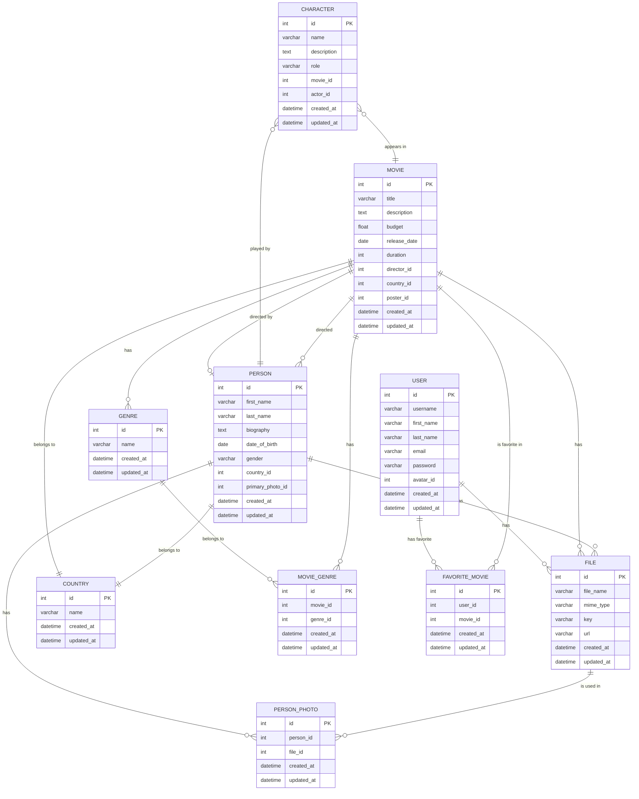

# Movie Database Design

## ER Diagram

```mermaid
erDiagram
    USER {
        int id PK
        varchar username
        varchar first_name
        varchar last_name
        varchar email
        varchar password
        int avatar_id
        datetime created_at
        datetime updated_at
    }
    
    FILE {
        int id PK
        varchar file_name
        varchar mime_type
        varchar key
        varchar url
        datetime created_at
        datetime updated_at
    }

    MOVIE {
        int id PK
        varchar title
        text description
        float budget
        date release_date
        int duration
        int director_id
        int country_id
        int poster_id
        datetime created_at
        datetime updated_at
    }

    CHARACTER {
        int id PK
        varchar name
        text description
        varchar role
        int movie_id
        int actor_id
        datetime created_at
        datetime updated_at
    }

    PERSON {
        int id PK
        varchar first_name
        varchar last_name
        text biography
        date date_of_birth
        varchar gender
        int country_id
        int primary_photo_id
        datetime created_at
        datetime updated_at
    }

    COUNTRY {
        int id PK
        varchar name
        datetime created_at
        datetime updated_at
    }

    GENRE {
        int id PK
        varchar name
        datetime created_at
        datetime updated_at
    }

    MOVIE_GENRE {
        int id PK
        int movie_id
        int genre_id
        datetime created_at
        datetime updated_at
    }

    FAVORITE_MOVIE {
        int id PK
        int user_id
        int movie_id
        datetime created_at
        datetime updated_at
    }

    PERSON_PHOTO {
        int id PK
        int person_id
        int file_id
        datetime created_at
        datetime updated_at
    }

    USER ||--o{ FILE : "has"
    MOVIE ||--o{ FILE : "has"
    MOVIE ||--|| COUNTRY : "belongs to"
    MOVIE ||--o{ GENRE : "has"
    MOVIE ||--o| PERSON : "directed by"
    CHARACTER }o--|| MOVIE : "appears in"
    CHARACTER }o--|| PERSON : "played by"
    PERSON ||--|| COUNTRY : "belongs to"
    PERSON ||--o{ FILE : "has"
    PERSON }o--|| MOVIE : "directed"
    USER ||--o{ FAVORITE_MOVIE : "has favorite"
    MOVIE ||--o{ FAVORITE_MOVIE : "is favorite in"
    GENRE ||--o{ MOVIE_GENRE : "belongs to"
    MOVIE ||--o{ MOVIE_GENRE : "has"
    PERSON ||--o{ PERSON_PHOTO : "has"
    FILE ||--o{ PERSON_PHOTO : "is used in"
```